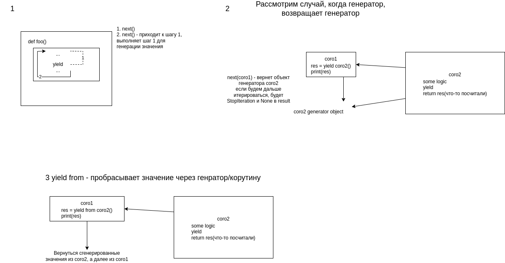

### Генераторы/Корутины

Docs from Python:

* https://peps.python.org/pep-0342/
* https://peps.python.org/pep-0380/
* https://peps.python.org/pep-0492/

Генератор = Корутина

Генератор - имеет выражение/оператор yield. Генерирует или принимает значение.
send() - старт(with None) или отправка внутрь значения для обработки
throw() - проброс внутрь исключения
close() - закрытие генератора

#### Эффективнее всего использовать у I/O bound

* 1 системный поток
* Событийная модель(модель Макдональдса с 1 кассиром)
* Управление корутинами полностью лежит на разработчиках
* Не вызывает апи ОС, что может сыграть нам на руку, нежели работать с потоками

yield - генерация или принятие извне значения
yield from - проборос yield через корутину
await = yield from

await работает с awaitable:
1. Нативная корутина async def
2. types.coroutine декоратор
3. class with __await__ method

Домашняя работа:
Обрабатывать неблокирующие вызовы сокетов для обработки данных с async/await
