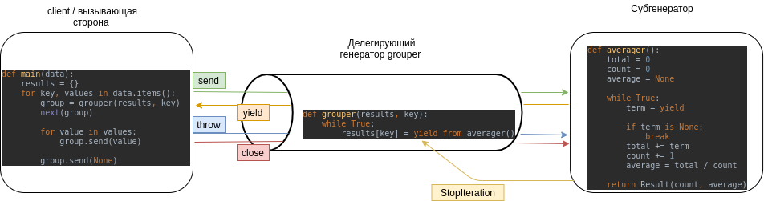

# Coroutines или Сопрограммы

Сопрограмма может находиться в одном из 4 сотояний.
`inspect.getgeneratorstate()`

`'GEN_CREATED'` - ожидает начала выполнения

`'GEN_RUNNING'` - выполняется интерпретатором

`'GEN_SUSPENDED'` - Приостановлена в выражении yield

`'GEN_CLOSED'` - исполнение завершилось

*делегирующий генератор*

Генераторная функция, содержащая выражение yield from <iterable>

*субгенератор*

Генератор, полученный от итерируемого объекта <iterable> в выражении yield from.
Это именно тот "субгенератор", который упомянут в заглавии документа PEP 380: "Syntax for Delegating to a Subgenerator"

*вызывающая сторона*
В PEP 380 обозначается клиентский код, который вызывает делегирующий генератор. В зависимости от контекста, типо клиент

Пример: [coroaverager3.py](coroaverager3.py)

