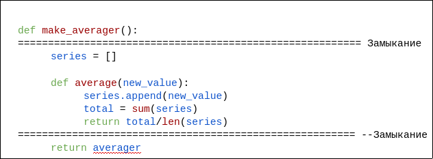
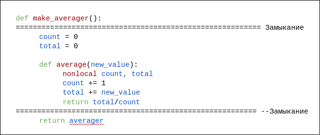

# Python декораторы

**Декоратор** - это вызываемый объект, который принимает другую функцию в качестве аргумента(декорируемую функцию)ю
Декоратор может производить какие-то операции с функцией и возвращает либо ее саму, либо другую заменяющую ее функцию
или вызываемый объект

**Метапрограммирование** - изменение поведения программы в процессе ее выполнения

**Замыкание** - это функция с расширенной областью видимости, которая охватывает все неглобальные переменные,
на которые есть ссылки в теле функции, хотя они в нем не определены. Не имеет значения, является функция анонимной или нет;
важно лишь то, что она может обращаться к неглобальным переменным, определенным вне ее тела.

Пример замыкания с изменяемым типом:

Пример замыкания с неизменяемыми типами:

Почему **`nonlocal`**?
Таким образом мы допускаем возможность использовать переменную с замыкания.
Без `nonlocal` наша переменная переопределяется в теле локальной функции.
