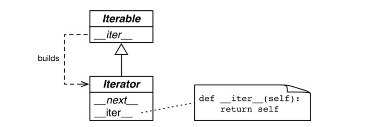

# Итераторы и Генераторы

По примеру: [sentence.py](sentence.py)

Всякий раз как интерпретатору нужно обойти объект x, он автоматически вызывает функцию iter(x)

Встроенная функция iter выполняет следующие действия.

1. Смотрим, реализирует ли объект метод __iter__, и, если да, вызывает его, чтобы получить итератор.
2. Если метод __iter__ не реализован, но реализован метод __getitem__, то Python создает итератор, который пытается 
извлекать элементы по порядку, начиная с индекса 0.
3. Если и это не получается, то возбуждается исключение - обычно с сообщением "Sentence object is not iterable", 
где Sentence - класс объекта

# Итерируемые объекты и Итераторы

***Итерируемый объект***

Любой объект, от которого встроенная функция `iter` может получить итератор. Объекты, которые реализуют метод `__iter__`,
возвращающий *итератор*, являются итерирумемыми. Последовательности всегда итерируемы, поскольку это объекты, реализующие 
метод `__getitem__`, который принимает индексы, начинающиеся с нуля.

**В стандартном интерфейсе итератора:**

`__next__` - Возвращает следующий доступный элемент и возбуждает исключение `StopIteration`, когда элементов не осталось.
`__iter__` - Возвращает self; это позволяет использовать итератор там, где ожидается итерируемый объект, например, 
в цикле for

***Итератор***

Любой объект, реализующий метод `__next__` без аргументов, который возвращает следующий элемент или возбуждает исключение 
`StopIteration`, если элементов не осталось. В Python итераторы реализуют также метод `__iter__` и потому сами являются
*итерируемыми объектами*.

 
 