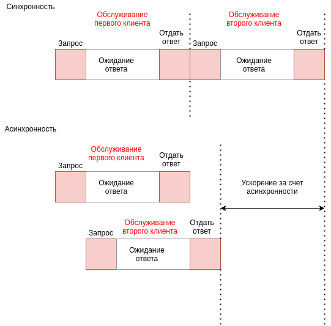

# Синхронный и асинхронный:

В **синхронных** операциях задачи выполняются друг за другом. В **асинхронных** задачи могут
запускаться и завершаться независимо друг от друга. Одна асинхронная задача может запускать и продолжать выполняться, 
пока выполнение переходит к новой задаче. Асинхронные задачи не блокируют(не заставляют ждать завершения выполнения задачи) 
операции и обычно выполняются в фоновом режиме.

 
 * Синхронность: блокирует операции
 * Асинхронность: не блокирует операции
 * Конкурентность: совместный процесс
 * Параллелизм: параллельный прогресс
 
 
Параллелизм подразумевает конкурентность. Но конкурентность не всегда подразумевает параллелизм.

**Потоки(Threads)**

Пример 1: [thread_module.py](thread_module.py)

Таким образом мы запустили 5 потоков для совсместной работы и после их старта(т.е. после запуска функции worker) 
операция **не ждет** завершения работы потоков прежде чем перейти к следующему оператору print. Это асинхронная операция.

**Продолжение коспектирования и перевода... **

https://pymotw.com/3/threading/index.html

# Краткие сведения о **GIL**:

* Одновременно может выполняться один поток
* Интерпретатор Python переключается между потоками для достижения конкурентности
* GIL применим к CPython(стандартной реализации). Но такие как, например Jython и IronPython не имеют GIL
* GIl делает однопоточнвые программы быстрыми
* Операциям ввода/вывода GIL обычно не мешает
* GIL позволяет легко интегрировать непотокобезопасные библиотеки на C, благодаря GIL у нас есть
много высокопроидительных расширений/модулей, написанных на C
* Для CPU зависимых задач интерпретатор делает проверку каждые N тиков и переключает потоки.
Таким образом один поток не блокирует другие.

GIL - синхронизация между потоками в Python

# Процессы (Processes)

Чтобы достичь параллелизма в Python был добавлен модуль **multiprocessing**, который предоставляет API, и выглядит очень похожим,
если вы использовали **threading** раньше.

Пример: [multiprocessing_module.py](multiprocessing_module.py)

[multiprocessing_module2.py](multiprocessing_module2.py)

[multi_proc.py](multi_proc.py)

# Реализация спиннера загрузки при помощи Тредов и asyncio

Thread пример: [single_threaded.py](single_threaded.py)

asyncio пример: [spinner_asyncio.py](spinner_asyncio.py)

# Синхронность и асинхронность

